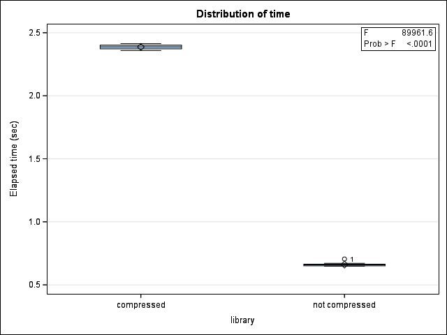

# Using Compressed Data in SAS

SAS has a variety of tools for working with compressed data. This
article will describe how to use them, and why.

Compression programs look for patterns in the data, and then replace the
original file with a file that describes those patterns. Nothing is
lost\--the description contains all the information needed to recreate
the original file. Normally the description is smaller than the original
file, but how much smaller will depend on the data itself and the
compression scheme used. With the compression schemes build into SAS, the
"compressed" file can sometimes be bigger than the original!

:::{.callout-tip}
It takes CPU time to compress or uncompress a file.
Compression trades CPU power for disk space. For
files you use constantly, this may not be a good trade. 
:::

We strongly
you encourage to compress any data sets you are not using on a regular
basis.

## Compressing SAS Data Sets

You can turn on SAS file compression at three levels.

| Level | Code example |
|-------|--------------|
|system |`options compress=binary;` |
|library|`libname z "Z:/SAS" compress=binary;` |
|data set | `data output-data(compress=binary);` |

Setting the COMPRESS system option means any data set you create
will be compressed.  Setting the LIBRARY option means all data
created in that library will be compressed.  And the DATA step
option means that particular data set will be compressed.

The COMPRESS option can take one of
two values: `binary` or `char` (or equivalent to `char`, `yes`).
The `char` compression is likely to be the most efficient if your
variables are largely character, while `binary` compression works
with both numeric and character data.

Compression works observation-by-observation.  Results depend
on how much data is in each observation.
However, it\'s very difficult to predict which will work
better for a particular data set. You may want to experiment and see.

To use a compressed data set takes no special syntax whatsoever. SAS
recognizes that the data set is compressed and uncompresses each
observation automatically as it reads it.

## Examples

To illustrate, let's set up a library with disk access
equivalent to the WORK library, and try a few examples.

```{r setup, include=FALSE}
library(SASmarkdown)
try(unlink("BoxPlot.png"))
```

```{sas macros, include=FALSE, collectcode=TRUE}
/* datastep
one binary and many continuous vars
rep     : number of data sets
lib     : data set library
nvar    : total number of vars
nbin    : number of binary vars
nlikert : number of likert scale (1:5) vars
nobs    : number of observations
timedata: data set for timing data
*/

/* output file sizes:
4GB: nvar=5000 nobs=100000
7.5GB: nvar=10000 nobs = 100000
2GB: nvar=5000 nobs= 50000
1GB: nvar=2500 nobs= 5000
*/

%macro datastep(rep=15, 
				lib=work, dsstub=example,
				nvar=5000, nbin=10, nlikert=20,
				nobs=100000,
				timingdata="");
%do k = 1 %to &rep;
	/* Start timer */
	%let _timer_start = %sysfunc(datetime());
		data &lib..&dsstub&k; /* 7.5 GB */
			array x {&nvar};
			do i = 1 to &nobs;
				do j = 1 to &nbin;
					x[j] = rand('bernoulli', 0.5);
				end;
	  			do k = 1 to &nlikert;
	  				x[(j-1) + k] = rand('table', .2, .2, .2, .2, .2);
	  			end;
				do l = 1 to %eval(&nvar - &nbin - &nlikert);
					x[(j-1) + (k-1) + l] = rand('uniform');
				end;
	  			output;
			end;
			drop i j k l;
		run;
	/* Record timer */
	%let timer&k = %sysevalf (%sysfunc (datetime()) - &_timer_start) ;
%end;

%if &timingdata ne "" %then %do;
	data &timingdata;
		proc = "data";
		library = "&lib";
		do k = 1 to &rep;                     
	    	time = symgetn (cats ("timer", k)) ;
	    	output ;                                 
	  		end ;
		run;
	%end;
%mend datastep;
```

First let's see how the (uncompressed) WORK library is set up.
```{saslog}
libname work list;
```

Next let's set up a compressed library with the same disk access
speed.

```{saslog wkcmp, collectcode=TRUE}
libname wkcmp "C:/temp" compress=binary;
```

### "Compression" can increase size
Using the COMPRESS option is not automatically a good thing!
In this example, it actually increases the size of the data
set.

```{saslog class, SASproctime=FALSE}
data wkcmp.class;
	set sashelp.class;
	run;
```

The `class` data has only a few variables, and they
are mostly numeric.  There is not a lot here to compress!

### Character data can compress well

In an example with only a few variables, but mainly
composed of character data, we get good compression.
Here is what a few observations of the data look like.

```{sas}
proc print data=sashelp.eismsg(obs=5);
run;
```

And it compresses very well.
```{saslog char, SASproctime=FALSE}
data wkcmp.eismsg;
	set sashelp.eismsg;
	run;
```

### Compression is relative to observation length
Consider a data set with 10,000 variables and 10,000
observations.  All the data values are numeric (and
randomly generated).

:::{.callout-tip}
If you are experimenting with compressing a large
data set, a reasonably big subset can tell you
what you need to know.
:::

```{saslog large, include=FALSE, collectcode=TRUE}
* 10,000 vars by 10,000 observations, all numeric;
%datastep(rep=1, nvar=10000, nobs=10000, lib=work);
```

Compressing all the observations gives us some
reduction in file size.

```{saslog fullvars, SASproctime=FALSE}
data wkcmp.example1;
	set work.example1;
	run;
```

Taking the same number of variables but with fewer observations
we see the same (relative) compression.

```{saslog lessobs, SASproctime=FALSE}
data wkcmp.example1;
	set work.example1(obs=500);
	run;
```

### More variables can mean more compression
Whether or nor compression provides a benefit depends
very much on the specific data set.

Compressing a small number of variables *increases*
the data set size with this data set
(but compare to the character data example, above).

```{saslog lessvars1, SASproctime=FALSE}
data wkcmp.lessvars;
	set work.example1(obs=500 keep=x1-x10);
	run;
```

With more variables, the compressed data set
is about the same size as the original data set -
we just break even.
```{saslog lessvars2, SASproctime=FALSE}
data wkcmp.lessvars;
	set work.example1(obs=500 keep=x1-x75);
	run;
```

With even more variables - more data values
in each observation - we finally see a reduced
file size from compression.
```{saslog lessvars3, SASproctime=FALSE}
data wkcmp.lessvars;
	set work.example1(obs=500 keep=x1-x1000);
	run;
```


### Increased compression == slower processing
To see the trade-off in file size versus processing
speed, consider how long it takes to generate
15 data sets like the example above, first in
library WORK, and then in library `wkcmp`.

When we compare the elapsed times, we see using
compressed data is slower.

```{sas glm, echo=FALSE}
%datastep(rep=15, lib=work, nobs=10000, timingdata=data_work);

%datastep(rep=15, lib=wkcmp, nobs=10000, timingdata=data_wkcmp);

* Comparing real timing;
data localtiming;
	length library $8;
	set data_work data_wkcmp;
	run;

proc format;
  value $ cmp 'wkcmp' = 'compressed'
            'work' = 'not compressed';
run;

ods graphics on;
ods select ParameterEstimates BoxPlot;
proc glm data=localtiming;
	class library;
	model time = library / solution ss3;
	label time = "Elapsed time (sec)";
  format library $cmp.;
	run;
```




