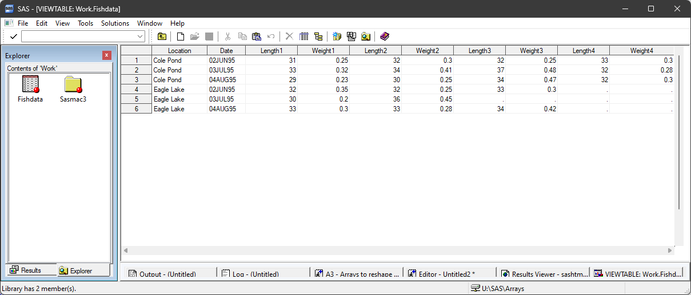
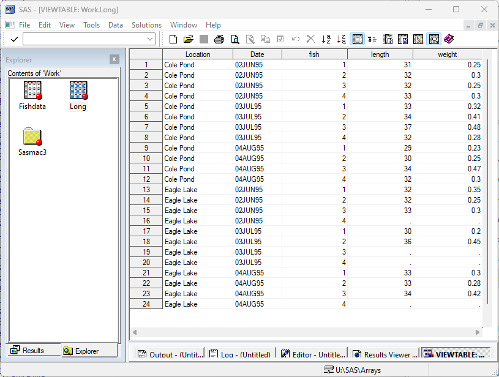

# Reshape Wide to Long

```{r setup, include=FALSE}
library(SASmarkdown)
```

We sometimes need to reshape a data set, converting data that has been
recorded in multiple variables into multiple observations, or vice versa.
This is an especially common data manipulation where we have data with
repeated observations for a common unit.

Consider this example (from SAS):

```{sas fishdata, collectcode=TRUE}
data fishdata;
   infile datalines missover;
   input Location & $10. Date date7.
         Length1 Weight1 Length2 Weight2 Length3 Weight3
         Length4 Weight4;
   format date date7.;
   datalines;
Cole Pond   2JUN95 31 .25 32 .3  32 .25 33 .3
Cole Pond   3JUL95 33 .32 34 .41 37 .48 32 .28
Cole Pond   4AUG95 29 .23 30 .25 34 .47 32 .3
Eagle Lake  2JUN95 32 .35 32 .25 33 .30
Eagle Lake  3JUL95 30 .20 36 .45
Eagle Lake  4AUG95 33 .30 33 .28 34 .42
;
```

Each observation records the fish weights and lengths observed on a given
date from a give body of water.  There are two to four fish observed on
each occasion.



If we wanted to know the mean length and mean weight of all the
fish observed, we would like all the data values to be in two
columns so that we can calculate this with PROC MEANS.



There are generally two approaches we can take to reshaping these data.  If
our goal is to convert a single repeated measure, we can use PROC TRANSPOSE.
More generally, for example where we have multiple repeated measures, we 
make use of ARRAYs.

## Using Arrays
Recall that a SAS `ARRAY` is essentially a list of variables, and that
this list makes it easy to loop over those variables.  In this case we
have two lists of variables - length1-length4 and weight1-weight4.  We
would like to take the values from one list and put them into a single
column.  We can use an ARRAY to loop over the variables.  The key here
is to use an explict `OUTPUT` statement to turn one observation into
four observations.

To simplify this first example, let's focus on fish `length`.

```{sas long1, collectcode=TRUE}
data long;
	set fishdata;
	array len{*} length1-length4;
	do fish=1 to 4;
		length = len{fish};
		output;
	end;
run;
```
```{sas long1 mean}
proc means data=long;
  var length;
run;
```

- The ARRAY statement defines `len` as an array reference,
a convenient way of specifying any of the four length variables.
- DO and END form our loop-within-an-observation.  We call our
loop index `fish` because this variable will eventually identify
individual fish in our long data.
- We assign `len{fish}` values all to a single new variable, `length`.
- We OUTPUT for each new value of `length`.

Looking at the resulting data set (or at least part of it)
```{sas print long1}
proc print data=long(obs=8
    drop=date weight1-weight4);
run;
```

we see we have retained the wide data, in addition to the properly
structured `length` variable at the end.  To complete this exercise
we can drop the original variables in our *output* data set, restructure
our weight variables, and remove observations with missing data.

```{sas long2, collectcode=TRUE}
data long;
	set fishdata;
	array len{*} length1-length4;
	array wgt{*} weight1-weight4;
	do fish=1 to 4;
		length = len{fish};
		weight = wgt{fish};
/* delete empty observations */
    if length eq . and weight eq . then delete;
/* output good observations  */
		else output;
	end;
/* drop no longer needed variables */
  drop length1-length4 weight1-weight4;
run;
```
```{sas long2 means}
proc means data=long;
  var length weight;
run;
```
```{sas print long2}
proc print data=long;
run;
```

## PROC TRANSPOSE
PROC TRANSPOSE is another method of converting data from wide
to long form.  It is appealing because you do not need to understand
DATA step programming.  However, it's limitation is that all the
data values to be transposed end up in one column (in the previous example,
multiple repeated measures ended up in multiple columns).

- an OUT option specifies the output data set
- BY specifies the variable(s) that identify unique observations
- VAR specifies the variables to be transformed

The new data column and the within-observation-index will have
default names.

```{sas transpose}
proc transpose data=fishdata
  out=transfish;
  by location date;
  var length1-length4;
  run;
  
proc print; run;
```

We can clean this up a little with:

- PREFIX names the final column of repeated measurements
- RENAME the within-observation-index
- WHERE removes observations with missing data

```{sas transpose better}
proc transpose data=fishdata
  out=transfish(
    rename=(_name_=fish)
    where=(length1 ne .))
  prefix=length;
  by location date;
  var length1-length4;
  run;
  
proc print; run;
```
  
Transforming multiple measures (both lengths and weights) would require
more than a single PROC TRANSPOSE - it is more efficient to use the ARRAY technique!

Last revised: 08/22/24

