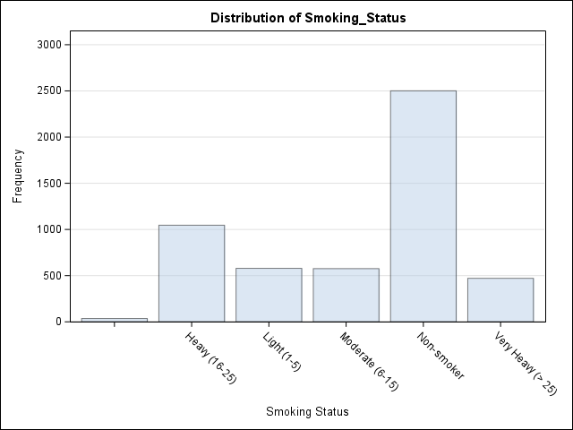

# Frequency Tables and Cross-tabulation
```{r setup, include=FALSE}
library(SASmarkdown)
```

`PROC FREQ` provides a core command for a number of tasks that
revolve around frequency tables and crosstabulations (contingency
tables).  You will use PROC FREQ for

- one-way tables
- two-way tables
- chi-square tests of association
- categorical measures of association, and other measures based on contingency tables
- bar charts
- creating data sets of counts or percents

Documentation is found in the [Base SAS 9.4 Procedures Guide: Statistical Procedures](http://support.sas.com/documentation/cdl/en/procstat/66703/HTML/default/viewer.htm#procstat_freq_toc.htm).

## Basic Use - One-Way Tables
In its simplest use, PROC FREQ gives you counts and percents.

```{sas simple}
proc freq data=sashelp.heart;
    tables smoking_status;
run;
```

## Minimal Specification

Below is the barest `PROC FREQ`.  Here, the default data set is `_LAST_` (if there is one!),
and the default 
variables to analyze are `_ALL_`.  (This example produces a lot of output!  So
I haven\'t show the output here.)
```{sas bare, collectcode=TRUE}
data heart;
  set sashelp.heart;
  run;
```

```{sas, eval=FALSE}
proc freq;
run;
```

## Table Requests

You can request one-way tables, two-way (or n-way) tables.  There is a table request
\"algebra\" for n-way tables.

You can request multiple
tables per `TABLES` statement, and you can use multiple `TABLES` statements per PROC.

### One-way
Request one-way frequency tables by listing variables (numeric and/or character) on
a TABLES statement.

```{sas oneway}
proc freq;
  tables smoking_status;
	run;
```

You can drop extra statistics, include missing values, save the table as data,
and request plots with options on the TABLES statement.

```{sas less, echo=-1}
ods graphics on;
proc freq;
  tables smoking_status / nocum missing plots=freqplot;
	run;
```


### Two-way
Two-way tables are specified as rows*columns.

```{sas twoway}
proc freq;
	tables smoking_status*sex;
	run;
```

> The table request \"algebra\" consists of variable lists, the asterisk for
\"crossing\" variables, and parentheses to distribute the crossing operation.

  So a specification like `A*(B C)` is equal to `A*B A*C`.  In a data set with 
  variables A through F, in order, the specification
  `(A--C)*(D--F)` would mean `A*D A*E A*F B*D B*E B*F C*D C*E C*F`.

As with one-way tables, crosstabs show you more cell statistics than you are
typically interested in, and you may with to add a chi-square hypothesis test.
These are done through TABLES options.

```{sas twoway_less}
proc freq;
	tables smoking_status*sex / norow nopercent chisq;
	run;
```

(To get a more sensible ordering of these categories, see
[Using Informats to Reorder Data](4-19_SAS_user_informats.html).)

### Multiple requests per TABLES statement

As implied by the request algebra, a single `TABLES` statements may have more than one 
table request, and even more than one type of table requested.
```{sas multireq}
proc freq;
	tables smoking_status smoking_status*sex;
	run;
```

Once you start adding table options, however, you will
find that you typically want to request multiple
tables of the same type on any one TABLE request.
Any options specified will apply to all the tables
requested!

```{sas multifreq}
proc freq;
	tables smoking_status sex / nocum;
	run;
```

### Multiple TABLES statements

It is also possible to have multiple `TABLES` statements.  This is especially
useful when specifying different table options for distinct groups of
variables.
```{sas multitable}
/* suppress some default output, and request additional statistics */
proc freq;
	tables smoking_status / nocum;
	tables smoking_status*sex / nopercent nocol chisq;
	run;
```

## Using Summary Data
With frequencies and crosstabs in particular, it is easy to
work with data that is given in summary form.
```{sas summary, collectcode=TRUE}
/* the data in summary or "table" form */
data coffee2;
  input loc $ type $ count;
datalines;
drive-up cappuccino 2
window   cappuccino 4
drive-up espresso   6
window   espresso   2
drive-up iced       2
window   iced       2
drive-up kona       2
window   kona       9
;
```

The key to using these data is to recognize that each
observation in the data set represent more than one
instance of the phenomenon to be analyzed (here, visits
to a coffee stand).  We add a WEIGHT statement so that
each observation (a combination of categories) is
properly counted.  (Many other PROCs use a FREQ statement.)

```{sas weights}
proc freq data=coffee2;       /* weighted data */
	tables type*loc / nopercent norow chisq;
	weight count;
	run;
```

You can also use `PROC FREQ` to create these kinds of summary
data sets, with the `OUT=` option on the TABLES statement.
```{sas outputdata}
proc freq data=coffee2 noprint;   /* save a crosstab as summary data */
	tables loc * type /	out=coffeetable;
	weight count;
	run;

proc print data=coffeetable; run;
```
