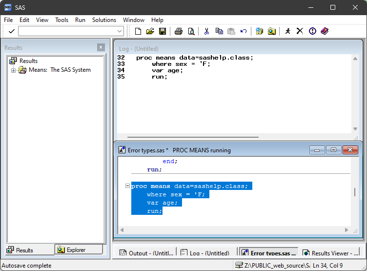
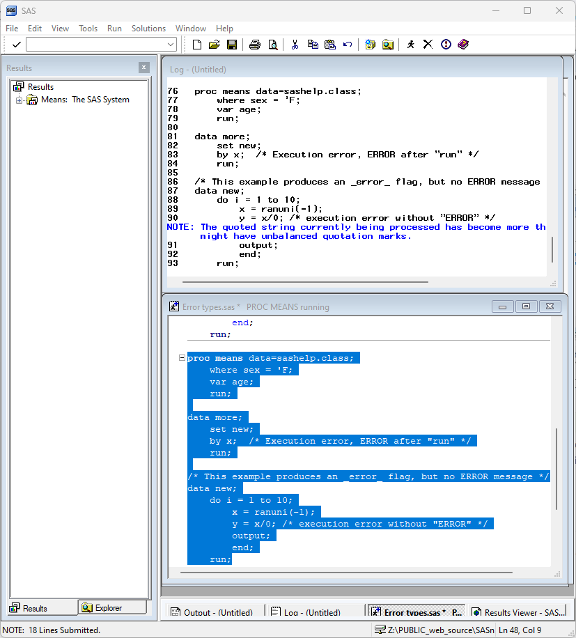

# Types of Errors

```{r setup, include=FALSE}
library(SASmarkdown)
```

There are a number of different errors you may run across when working with
SAS.  In some cases SAS might simply fail to start.  In other cases
SAS will write an ERROR message to the log file and stop processing -
the details of what happens next depends on whether you are working
interactively or in batch mode.  In still other cases SAS will write
a NOTE to the log file and produce a missing value.  And in some
instances SAS will write a WARNING message about a potential error.
Finally, there are plenty of mistakes you can make that SAS will
not detect at all.

:::{.callout-important}
When working interactively, make a habit of checking your log
before you get excited about your results.  In interactive mode,
SAS can continue to produce output after encountering an ERROR.
Use the DMSSYNCHK system option to change this behavior.
:::

## SAS fails to start up
This is usually a configuration problem of some kind.  Often a box will flash on your screen
briefly, perhaps with a message about "kernel initialization" or an operating system error
code.

If you have a personal `sasv9.cfg` file, or have created your own SAS startup icon (Windows),
the problem could lie there.  Review our notes on [custom configurations](custom_configurations.html).
Otherwise, if you are an SSCC member, contact our [Help desk](https://www.sscc.wisc.edu/get-help/).

## SAS Errors
These are errors within your SAS code.

We can break programming errors into four types:

- Syntax errors
- Executable errors
- Mathematical errors
- Logical errors

## Syntax Errors
By *syntax errors* we mean any error that produces code that SAS cannot interpret.  These range
from simple typos, to mismatched quotes, missing semi-colons, and misused SAS keywords.  These
are all *compile-time* errors.

:::{.callout-tip}
## Recognizing Compile-time versus Execution-time errors
When SAS encounters a compile-time error, the error message is generally written in
the middle of the DATA/PROC step statements echoed in the log, immediately after the offending code.  Execution-time
errors are written after all of the statements have been echoed, after the run group.
:::

See [SAS 9.4 Language Concepts: Error Processing](https://documentation.sas.com/doc/en/lrcon/9.4/n1g8q3l1j2z1hjn1gj1hln0ci5gn.htm)
for more examples.

### Mistyped Keywords (typos)
A common typo, particularly if you work in more than one
programming language.
```{sas, SASproctime=FALSE, SASnotes=FALSE}
data new;
	do i = 1 to 10;
		x = ranuni(-1);
		outcome; /* mistyped OUTPUT */
		end;
	run;
```

In some cases SAS will correctly guess the keyword you meant.
You can use the NOAUTOCORRECT system option, if this annoys you.
```{sas, SASproctime=FALSE, SASnotes=FALSE}
prok means data=sashelp.class; /* mistyped PROC */
  var age;
run;
```

### Missing Semi-colon (;)
This is arguably the most common coding error in SAS.  The
SAS interpreter tries to understand the next keyword as
part of the previous statement.  SAS generally provides a
list of keywords that might have been acceptable at the
end of the previous statement ... but that's not the
problem!

```{sas, SASproctime=FALSE, SASnotes=FALSE}
data new;
	do i = 1 to 10;
		x = ranuni(-1)  /* missing semi-colon */
		output;
		end;
	run;
```

### Mismatched Quote
The error message for mismatched quotes depends on how much
code is submitted after the quote.

When working interactively, SAS might appear to just hang.

The interpreter is waiting for you to submit more code, to
finish specifying the step.

With more code, SAS might appear to be hung in the middle
of a step, but also give you a NOTE.



:::{.callout-tip}
## Mismatched ... something
When working interactively, SAS may be waiting for a
quote/statement/step/comment terminator, because you
forgot to type something.  The "universal" fix is
to submit the following code:

```sas
/* '; * "; */;
quit;
run;
```
:::

In batch mode with only a little code, your error message might look like this:
```{sas, SASproctime=FALSE, SASnotes=FALSE}
proc means data=sashelp.class;
	where sex = 'F;
	var age;
	run;
```

## Executable Errors
An *executable error* occurs when your code is syntactically correct,
but the resource (usually, data) that you reference is "missing"
(often, misnamed or in the wrong location).  This might be a file
or a variable that does not exist.

### Misplaced file
A really simple example is a file that does not exist.

```{sas, SASproctime=FALSE, SASnotes=FALSE}
data more;
  infile "mydata.txt";
	input x y z;
	run;
```

### Non-existant variable
```{sas, SASproctime=FALSE, SASnotes=FALSE}
proc means data=sashelp.class;
  var mpg;
  run;
```

### Variable not initialized
This error does not stop SAS, but it generally produces a
"mising values" NOTE and a variable (or variables)
that has only missing values.

```{saslog, SASproctime=FALSE}
data class;
  set sashelp.class(obs=2);
  barefoot_height = height - shoes;
  run;

proc print data=class(obs=5) noobs;
  var height shoes barefoot_height;
  run;
```

## Math Errors
In particular, dividing by zero produces NOTEs.

```{saslog, SASproctime=FALSE}
data new;
	do i = 1 to 3;
		x = ranuni(-1);
		y = x/0; /* math error with "NOTE" */
		output;
		end;
	run;
```

## Logical Errors
It is surprisingly easy to write code that SAS has no problem
interpreting, but that does not produce the result you intended.
No software can guard you from these sorts of errors.  This
could be as simple as using the wrong variable in a model:
`q10` instead of `q11`.  It could be putting calculations
in a DATA step in the wrong order (anything involving
conditional processing, or less commonly anything using
intermediate variables).

A common example is recoding a variable without considering
what to do with missing values - these may end up being
lumped in one category or another.  As an analyst,
whenever you are creating a new variable, it should occur
to you to find some way to check your result.

- If you are rescaling a continuous variable, is the correlation
between the original and the new variable one (1)?
- If you are recategorizing a variable, does a crosstab of the
original and the new variable produce a sensible table?  (Did
you include missing values in your crosstab?)