# Common SAS Plots

```{r setup, include=FALSE}
library(SASmarkdown)
```

Note that PROC SGPLOT and graphs produced in statistical
PROCs sometimes have different titles, regardless of the
TITLE statement.

The TITLE statement is a global option, that affects page
titles as well as (some) graph titles.

```{sas, collectcode=TRUE, include=FALSE}
ods graphics on;
run;
```

## Scatter Plots
### sgplot

```{sas, echo=-1}
ods graphics / imagename="simple_scatter";
title 'Fisher (1936) Iris Data';
proc sgplot data=sashelp.iris;
   scatter x=petallength y=petalwidth;
run;
```

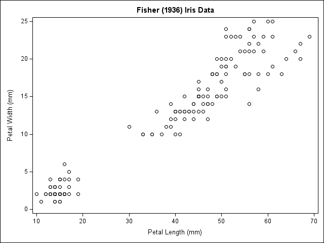

With groups identified by color or marker, depending on the
style template.

```{sas, echo=-1}
ods graphics / imagename="grouped_scatter";
title 'Fisher (1936) Iris Data';
proc sgplot data=sashelp.iris;
   scatter x=petallength y=petalwidth / group=species;
run;
```

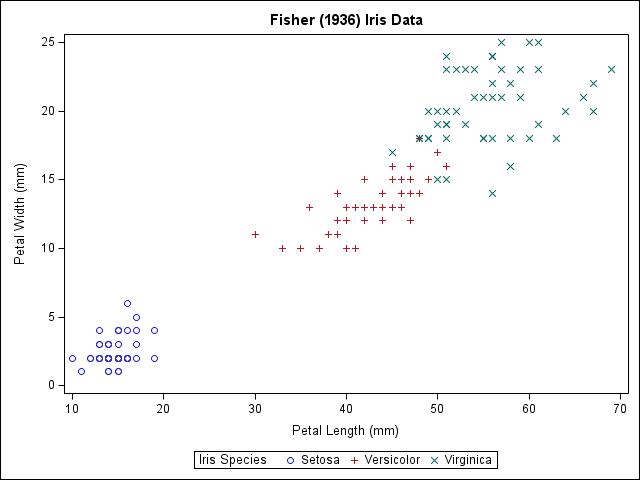

### proc corr
```{sas}
title 'Fisher (1936) Iris Data';
ods select scatterplot;
proc corr data=sashelp.iris plots=scatter(ellipse=none);
	var petallength petalwidth;
	run;
```
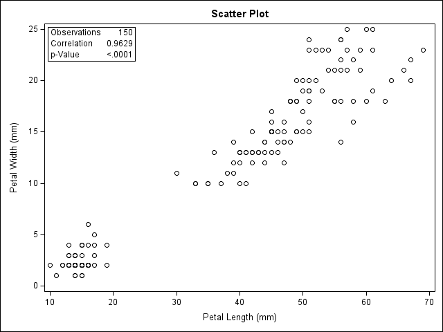

## Frequency Plots (Bar Charts)
Bar charts are often abused to show point estimates, like
means.  They are used to best visual effect when they
represent counts and percents.

### sgplot
```{sas, echo=-1}
ods graphics / imagename="barchart";
title "Framingham Heart Study";
proc sgplot data=sashelp.heart;
	vbar status / stat=percent;
	run;
```

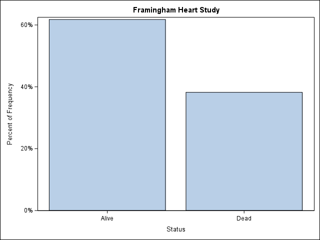

### proc freq (one-way)
```{sas, echo=-1}
ods graphics / imagename="freq_bar";
title "Framingham Heart Study";
ods select freqplot;
proc freq data=sashelp.heart;
	tables status / plots=freqplot(scale=percent);
	run;
```

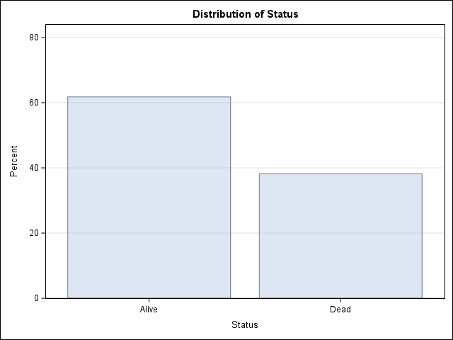

## Grouped Frequencies
### sgplot
```{sas, echo=-1}
ods graphics / imagename="grouped_bar";
title "Framingham Heart Study";
proc sgplot data=sashelp.heart;
	vbar sex / group=status groupdisplay=cluster;
	run;
```

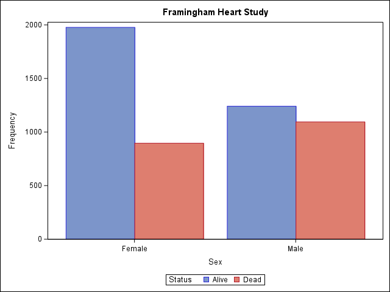

### proc freq (crosstabs)
```{sas}
title "Framingham Heart Study";
ods select freqplot;
proc freq data=sashelp.heart;
	tables status*sex / plots=freqplot(twoway=cluster);
	run;
```

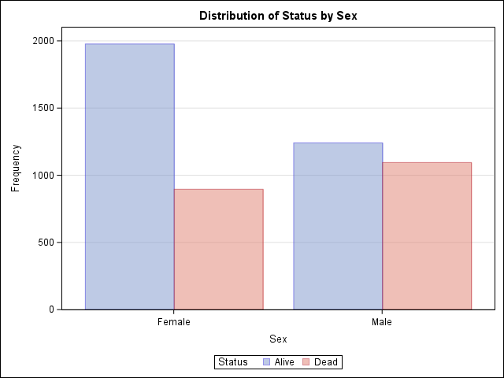

## Box Plots

Box plots are commonly used to show the distribution
of the data within categories.  Keep in mind that they do
not show you standard deviations or standard errors. Instead
they seek to identify observations that are outliers.

In this example, note that `strain` is a character variable,
so the category order is alphabetic order.  Reorder them
with [informats and formats](4-19_SAS_user_informats.html).

```{sas, collectcode=TRUE}
data Clover;
   input Strain $ Nitrogen @@;
   datalines;
3DOK1  19.4 3DOK1  32.6 3DOK1  27.0 3DOK1  32.1 3DOK1  33.0
3DOK5  17.7 3DOK5  24.8 3DOK5  27.9 3DOK5  25.2 3DOK5  24.3
3DOK4  17.0 3DOK4  19.4 3DOK4   9.1 3DOK4  11.9 3DOK4  15.8
3DOK7  20.7 3DOK7  21.0 3DOK7  20.5 3DOK7  18.8 3DOK7  18.6
3DOK13 14.3 3DOK13 14.4 3DOK13 11.8 3DOK13 11.6 3DOK13 14.2
COMPOS 17.3 COMPOS 19.4 COMPOS 19.1 COMPOS 16.9 COMPOS 20.8
;
```

### sgplot
```{sas, echo=-1}
ods graphics / imagename="sgplot_box";
title1 'Nitrogen Content of Red Clover Plants';
proc sgplot data=Clover;
	vbox nitrogen / category=strain;
	run;
```

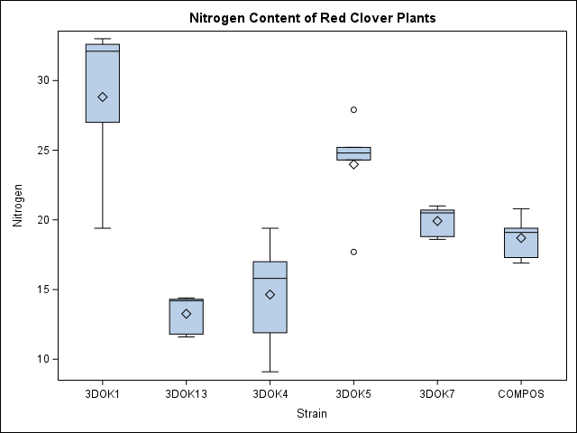

### glm
```{sas}
title1 'Nitrogen Content of Red Clover Plants';
ods select BoxPlot;
proc glm data = Clover; /* or PROC ANOVA */
   class Strain;
   model Nitrogen = Strain;
run; quit;
```

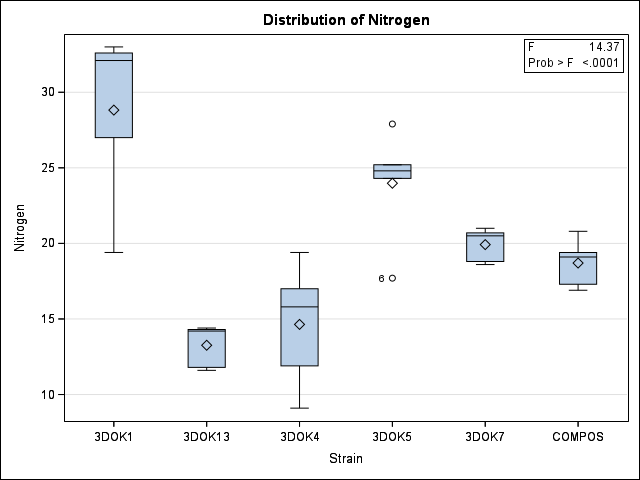

## Regression plots
### sgplot
```{sas, echo=-1}
ods graphics / imagename="sgplot_reg";
proc sgplot data=sashelp.cars;
	reg y=mpg_highway x=weight;
	run;
```

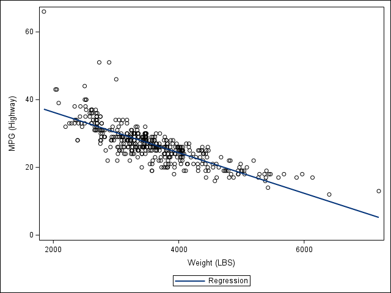

### reg
```{sas}
ods select FitPlot;
proc reg data=sashelp.cars;
	model mpg_highway = weight;
	run; quit;
```

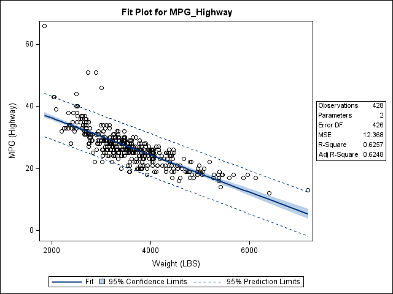

## Regression with a Categorical Variable
Different categories produce different lines. In other
words, if this were a regression, it would include interaction
terms.

### sgplot
```{sas, echo=-1}
ods graphics / imagename="sgplot_grouped_reg";
proc sgplot data=sashelp.cars;
	reg y=mpg_highway x=weight / group=origin;
	run;
```

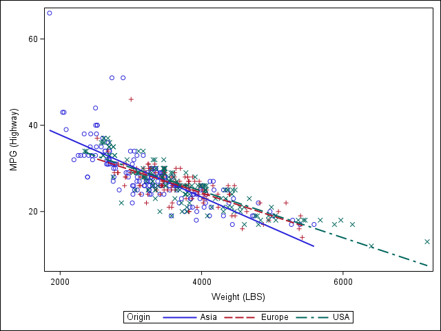

### sgpanel
```{sas}
proc sgpanel data=sashelp.cars;
	panelby origin;
	reg y=mpg_highway x=weight;
	run;
```

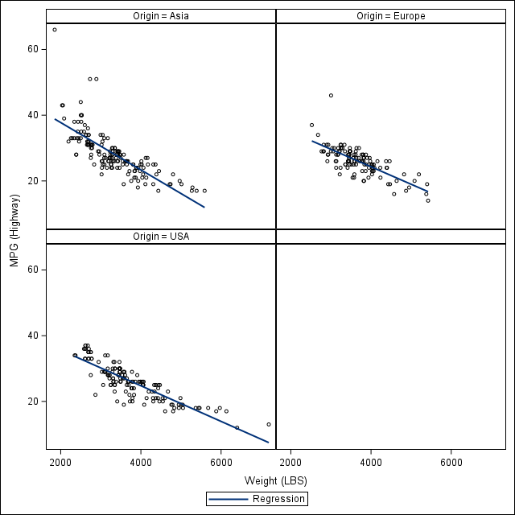
