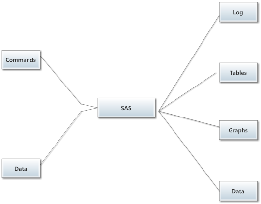
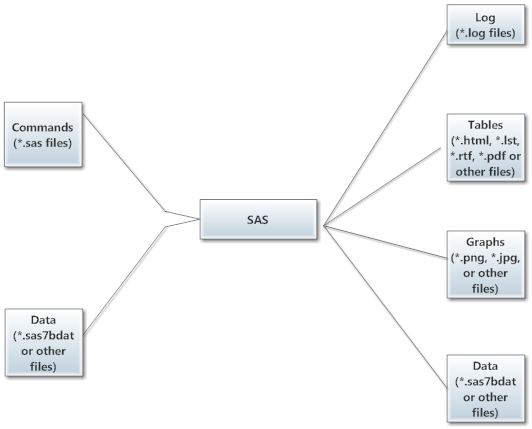

# Working with SAS Files

## SAS Processing
As with most statistical software, working on a project in SAS will
typically mean working with several different files.  The basic 
workflow will be to submit your SAS commands and data to the SAS
processor.  SAS interprets your commands, a block of code at a time,
and produces the desired output:  a log of the commands executed,
any statistical tables or graphs requested, and any data
sets (new or modified) requested.

The different types of input and output are saved as separate files.
Saving your commands and logs works pretty much the way you expect
it to:  you make the appropriate window active, then click **File ->
Save** in the menus.  Saving your data or statistical results is
best done by writing the appropriate code, so this is a little
less intuitive (details in the links below).

## SAS File types

Most files can be named whatever you like.  However, *data* files
are most gracefully handled if their names are one-word,
alpha-numeric names, i\.e\. avoid spaces and most special characters
in data set names.

File type      | File extension  | Save method
---------------|-----------------|-------------
commands       | .sas            | Menu, Ctrl-s
log            | .log            | Menu, Crtl-s, batch
results (docs) | .html, .docx, .pdf, etc | use `ODS`
results (text) | .lst            | use `ODS`, batch
graphs         | .png, .svg, etc | use `ODS graphics`
data sets      | .sas7bdat       | use a `LIBNAME`

### Command Files (\*.sas)

Command files should have a file extension of \".sas\".  These are
saved via the menus by clicking **File -> Save**.  Files with SAS
commands are saved as plain text.

In principle
you could create or view these with any text editor (SAS has recently
begun supporting VS Code), but most of us
find it easiest to set them up using the Editor window within SAS 9.4
or the Code tab in SAS Studio.
The color coding helps you spot typos quickly, and you can test
your code as you go by [submitting](SubmittingCode.html) highlighted blocks.

### Log Files (\*.log)

Log files should be saved with a file extension of \".log\".  Similar
to command files, these can be saved by making the Log window active
by clicking in it anyplace and then clicking **File -> Save**
in the menus.

Logs, like commands, are saved as plain text.

**A log is the one form of output that all SAS processing creates.**
Unlike a lot of other statistical software, this echo of your
commands, processing notes, and error messages is separate from
your statistical results.  When you are working interactively,
these notes appear in the Log window or tab and are being held in your
computer\'s memory (a *buffer*), so they are not saved unless you save them
manually.  You can save the log to a file
**automatically** by batch processing (recommended
when you are ready to archive a project).

An "old school" `PROC PRINTTO` and numerous `OPTION`s are
available for more nuanced logging.

### Results Documents (\*.html, \*.pdf, \*.docx, \*.lst, etc.)

Statistical tables and graphs can be saved together or separately, and
in several different formats.  Saving your results is best done
by adding the appropriate `ODS` commands to your SAS program.

Common formats for results are HTML, simple text (\"listing\" or lst),
Word document (\"docx\"), and Adobe (pdf).  Many
other formats are also possible.

By default, SAS produces results in HTML format in the Results Viewer
window, combining tables and
graphs into a single output document.  However, this is deleted when you
end your SAS session.  The options for saving your results manually
are clunky at best.  You will want to decide on a format for your output,
and add the appropriate `ODS` commands before and after the code
that produces what you want to save.  See [Saving SAS Output Files](saveSASoutput.html).

### Results Graphs (\*.png, \*.svg, \*.jpg, etc.)

It will be typical to save graphs as part of a results document, but
they can also be saved separately, and in several different
graphics formats.  As with tables, this is most gracefully accomplished
with `ODS` commands.  See [Saving Graphics](4-21_Simple_SAS_Graphs_with_ODS.html#saving-graphics).

You can also right-click on a graph in the Results Viewer and save it
manually.  This gets tedious quickly.

### Data Files (*.sas7bdat)

Data files should have a file extension of \".sas7bdat\".  These
are usually saved as part of a `DATA` command (a DATA *step*).
See [Saving SAS Data Sets](saveSASdata.html).

SAS can read and write data from/to a variety of formats, but to
process the data SAS generally must have it in it\'s own SAS format.  It is
usually convenient to save data in this format.

