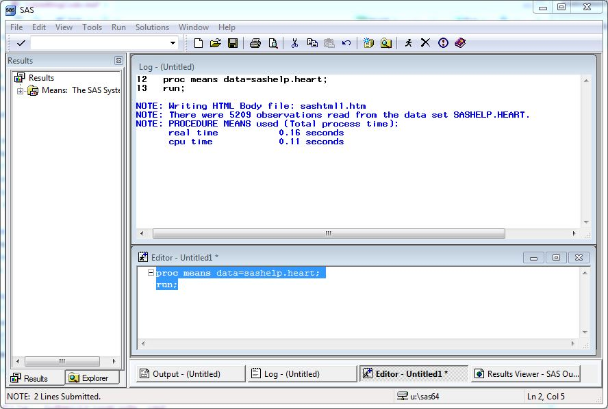
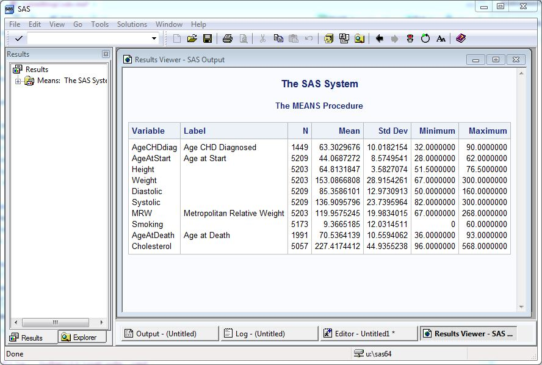

## Submitting code
Once you have written your SAS code in the Editor,
you \"submit\" it to the SAS processor.  You can submit code via the menus,
via the toolbar, or with a shortcut key.

When you submit code, SAS echos your code to the Log window along with
notes about processing (including ERROR messages).  If statistical tables
or graphs are produced, these pop to the front in the Results Viewer,
hiding your Editor and Log windows.

(Just because you see Results does not guarantee your program is error-
free, a point we will return to later.)

### Menus
You can highlight a portion of your code and submit it by clicking on
**Run > Submit** in the menus.

If no code is highlighted, this submits *ALL* the code in the Editor - either
a convenient shortcut or an annoying mistake!

### Toolbar
On the toolbar (if the Editor is the active window) is an icon for a
Running Programmer.  Clicking on that has the same results as using
**Run > Submit**.

### Shortcut Keys
Finally, you can submit code using the F3 or F8 keys at the top of your
keyboard.  These give you the same results as the menu or toolbar options.

