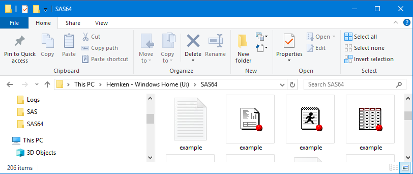

# Launching SAS Files from Windows Explorer

::: {.callout-tip}
## Use Simpler File Specifications
Double-click on SAS files to open them in SAS 9.4.  *This also
makes the folder containing the file the **default working directory**.*
This can simplify file specification in your code.
:::

[If you are using SAS Studio, you must first start SAS and then open a file.]

SAS program, data, and output files can be opened directly from Windows Explorer
by double-clicking on the file.  One advantage of launching SAS files in this way
is that the working directory is automatically set to the
location of the file.  This can simplify your SAS code, because you
can skip specifying paths for input and output files.

Additional options are available
by right-clicking and selecting an action from the pop-up context menu.
The context menu has many options. This article will explain what those options mean.

::: {.callout-tip}
## Windows 11
Under Windows 11 (e.g. the SSCC lab computers) a right-click gives you a context menu
with "Show more options" as one entry.  Click that to see the SAS options.
:::

## Program Files 

 
When you double-click on a SAS program file (any file with the extension
*.sas*), it opens in the classic SAS interface (also known
as the SAS Display Manager) in the Editor window.

::: {.callout-tip}
## Context Menu Options
The two most useful options here are **Open** and
**Batch Submit**.
:::

If you right-click on a SAS program file, you\'ll get the following
context menu:

  Menu Item                          | Action
 ------------------------------------|--------------------------------------------------------------------
  Open                               | Opens the program in the Editor (same as double-click)
  Batch Submit with SAS 9.4          | Runs the program as a batch job. Output is saved as .log and .lst files.
  Batch Submit with SAS 9.4  (UTF-8) | Runs the program as a batch job, but using UTF encoding.
  Open with SAS Enterprise Guide 8.3 | Open the program as a Program object in SAS Enterprise Guide
  Open with SAS 9.4                  | (the same as Open)
  Open with Universal Viewer 1.5     | Opens in the SAS Universal Viewer (use VS Code or Notepad++ instead !)
  Print                              | Prints the program from SAS to your default printer.
  Print with SAS 9.4                 | (same as Print)
  Submit with SAS 9.4                | Opens the program in the Editor and runs it. Output appears in the Review window.

## Data Files

 
Double-clicking on a SAS data file (a file with the extension
*.sas7bdat*) opens it in a
Viewtable window. However, if the data set has variables that are
formatted with user-defined formats, SAS will not be able to find those
formats and will refuse to open the data set.

::: {.callout-tip}
## Data with User Formats
If your data have user-defined formats, launch SAS from the
Start Menu first.
:::

If your data set has user-defined formats, you have two options:

1.  Launch SAS from the Start button, tell SAS where to find the formats
    using `libname library`, then open the data set either from the SAS
    Explorer.
2.  Launch the data set in SAS Enterprise Guide from the context menu. 
    Enterprise Guide will strip the user-defined formats out of your
    data set.

If you right-click on a SAS data file, you\'ll get the following context
menu:

| Menu item                         |   Action                          
------------------------------------|-----------------------------------
| Open                              | Opens the data set in a Viewtable (same as double-click)
| Open with SAS Enterprise Guide 8.3   | Open the data set as a Data object - ignores user-defined formats
| Browse with SAS 9.4               | (the same as Open)
| Open with Universal Viewer 1.5    | Open the data set in the Universal Viewer
| Print                             | Prints the entire data set to your default printer (unless there are user formats)
| Print with SAS 9.4                | (the same as Print)

## Output Files

 
 SAS "list" output files (files with the extension [.lst]{.InputCode})
are text files that can be opened with any suitable text editor or word
processor.  This is the default form of output for SAS batch
submissions.  

By default list output files are
produced with SAS fonts, and are often hard to read in other software. 
However, they remain a staple of "draft" quality output. To view these
files using the easy-to-read SAS fonts, it is convenient to open them in the SAS.

Double-clicking on a SAS output file opens it in a Preview window.

If you right-click on a SAS output file, you\'ll get the following
context menu:

  Menu item                        | Action
  -------------------------------- | -------------------------------------------------------------------------
  Open                             | Opens the file in Preview window, using SAS fonts (same as double-click)
  Open with SAS Enterprise Guide 8.3  | Open the file as a Text object (no SAS fonts !)
  Open with SAS 9.4                | (same as Open)
  Open with Universal Viewer 1.5   | (no SAS fonts)
  Print                            | Prints the output file from SAS to your default printer

Last Revised: 8/5/2024
