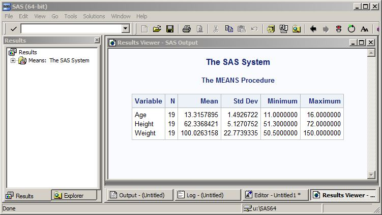
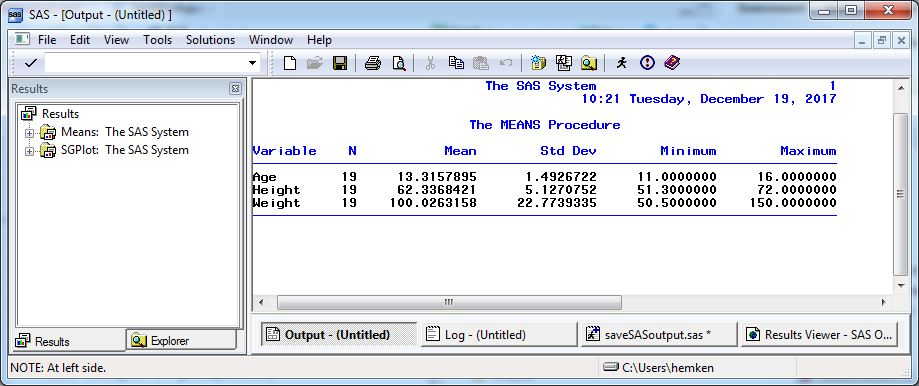
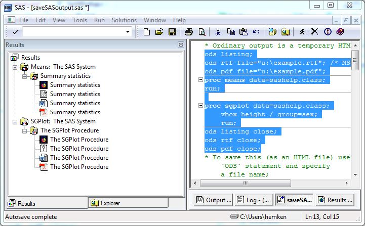

# Saving SAS Output Files

```{r setup, include=FALSE}
library(SASmarkdown)
```

SAS makes it possible to save your statistical tables and graphs in many
different formats, including

- HTML (web page) files, 
- text (ASCII) files, 
- PDF files, 
- Word files, 

and more.  For graphics, there are also a
variety of graphics file formats.  See [Understanding ODS destinations](https://documentation.sas.com/doc/en/pgmsascdc/9.4_3.5/odsug/p1n357e2fq6kjkn1ijsu3w97lxl1.htm#n1kl4pviz2igoan1atxoq7i9ul8e)
for more output options.

## HTML (Default) Output
As you work in SAS or SAS Studio, the statistical tables and graphs
output by your SAS procedures are displayed in the *Results Viewer*
and stored in a temporary HTML file.  This is good for day-to-day data
exploration and code development.

```sas
proc means data=sashelp.class;
run;
```



However, there are several disadvantages to this format.  Output
files are not
saved automatically.  The HTML format produces each graph as
a separate file, making 
it harder to save your output as a single file.
And it has a default style called "HTMLBLUE".

All of these problems are easily addressed through ODS commands written
into your code.

### Saving with ODS

You can automate saving your HTML output by redirecting your output to
a file with an `ODS HTML`
statement (\"ODS\" is an acronym for *Output Delivery System*).
There are two basic options:

- `file` or `body`
- `path`

The `file` or `body` option specifies the name of the file
to save.  The `path` option specifies where to save that
file.

To save a `PROC MEANS` and a boxplot would be

```sas
ods html file="example.html" path="U:/";
proc means data=sashelp.class;
  class sex;
  var height;
run;

proc sgplot data=sashelp.class;
	vbox height / group=sex;
run;
```

```{sas html-out, include=FALSE}
ods html file="example.html" path="SASnotes/SaveSASOutput"
  gpath="";
proc means data=sashelp.class;
  class sex;
  var height;
run;

proc sgplot data=sashelp.class;
	vbox height / group=sex;
	run;
ods html close;
```

[HTML OUTPUT FILE](SaveSASOutput/example.html)

To stop writing to a file (a *destination*)
	you close it.

```sas
ods html close;
```

Use the `HTML5` destination to create a document that includes the graphics and text in
a single file.

See the [ODS HTML statement](https://documentation.sas.com/doc/en/pgmsascdc/9.4_3.5/odsug/n0f5s1zezthhbrn1u0z71mh3wx64.htm) for numerous additional options.

### Changing Style

HTML files (and some other output destinations) have shaded cells
for the table headers, and a default color scheme
for graphs.  This is *style*.
You can change the style.
    
```sas
ods html file="example-styled.html" style=journal;

proc means data=sashelp.class;
  class sex;
  var height;
run;

proc sgplot data=sashelp.class;
	vbox height / group=sex;
	run;
ods html close;
```

```{sas style, include=FALSE}
ods html file="SASnotes/SaveSASOutput/example-styled.html" 
  gpath="" style=journal;

proc means data=sashelp.class;
  class sex;
  var height;
run;

proc sgplot data=sashelp.class;
	vbox height / group=sex;
	run;
ods html close;
```


[HTML STYLED OUTPUT FILE](SaveSASOutput/example-styled.html)

See a [gallery of SAS styles](https://documentation.sas.com/doc/en/pgmsascdc/9.4_3.5/odsug/p14qidvs5xf7omn14ommvsuhvmzn.htm).

### Saving through the Menus
If your results consist purely of tables and text, you can use
the SAS interface to re-save this file in a more obvious and
convenient location.  Click **File - Save As**, browse to a
location, specify a  file name, and pick one of the 
\"Webpage\" file types.  You save *everything* in the Results
Viewer.

If your results include graphs, as is very often the case, you
can still save everything via the SAS interface.  Click 
**File - Save As**, browse to a
location, specify a  file name, and then pick the 
\"Webpage, complete\" file type.  In addition to the HTML
file containing your tables and text, a folder *with the
same name as your file* will have each of your graphs saved
as a .png image file.

## Text (Listing) Output
You may prefer plain text ("listing") output.  This is saved
automatically when you run SAS in batch mode. We generally
recommend batch mode if you want to save simple output.

Listing output
is easy to share with colleagues, and is
great for archiving a project as well. 

Here, the `file` option
includes any directory (rather than using `path`).
	
```sas
ods listing file="U:/example.lst";
/* optionally, use better form characters */
options formchar="|----|+|---+=|-/\<>*";

proc means data=sashelp.class;
run;

proc sgplot data=sashelp.class;
	vbox height / group=sex;
	run;
```

```{sas listing-out, include=FALSE}
ods listing file="SASnotes/SaveSASOutput/example.txt"
  gpath="SASnotes/SaveSASOutput";
proc means data=sashelp.class;
run;
proc sgplot data=sashelp.class;
	vbox height / group=sex;
	run;
ods listing close;
```

Use the `options formchar` statement to get output that is
legible outside of SAS.

[LISTING OUTPUT FILE](SaveSASOutput/example.txt)

[LISTING OUTPUT GRAPH](SaveSASOutput/SGPlot1.png)

You can also switch to listing output when working interactively.
Listing output will be sent to the
Output window if you omit the `file` option.  This can be noticeably
faster than other forms of output, but
cannot show you graphs.;

```sas
ods listing;
proc means data=sashelp.class;
run;
```



## PDF and Word Output
Other output desinations work similarly.  For PDF and MS Word
documents, there is no `gpath`
option because graphs are included in the primary
file.

```sas
ods pdf file="U:/example.pdf"; /* Adobe PDF format */
ods word file="U:/example.docx"; /* MS-Word format */

proc means data=sashelp.class;
run;

proc sgplot data=sashelp.class;
	vbox height / group=sex;
	run;

ods word close; /* cannot be viewed until closed */
ods pdf close;
```

```{sas rtf-pdf, include=FALSE}
ods pdf file="SASnotes/SaveSASOutput/example.pdf"; /* Adobe PDF format */
ods word file="SASnotes/SaveSASOutput/example.docx"; /* MS-Word format */

proc means data=sashelp.class;
run;

proc sgplot data=sashelp.class;
	vbox height / group=sex;
	run;

ods word close; /* cannot be viewed until closed */
ods pdf close;
```

[PDF OUTPUT FILE](SaveSASOutput/example.pdf)

[WORD OUTPUT FILE](SaveSASOutput/example.docx)

Note you will **not** be able to look at intermediate results.  You have to `close` these
output destinations before you can view the files.

For additional options see [ODS PDF statement](https://documentation.sas.com/doc/en/pgmsascdc/9.4_3.5/odsug/n0mc4eolqoned0n16oy88mpj0e4g.htm#optCatLstn0krsmpzn5n29yn14y8rjz1rlvrs)
or [ODS RTF statement](https://documentation.sas.com/doc/en/pgmsascdc/9.4_3.5/odsug/p1vvsv8ucnjzjnn1wq5wrlp74mdb.htm).


## Multiple Destinations
SAS will happily write to multiple files
simultaneously.  If you check the Results pane
	when multiple destinations are \"open\",
	you will find that SAS added the PROC MEANs
	table to several files!

```sas
ods listing;
ods rtf file="u:\example.rtf"; /* MS-Word format */
ods pdf file="u:\example.pdf";
proc means data=sashelp.class;
run;

proc sgplot data=sashelp.class;
	vbox height / group=sex;
	run;
ods listing close;
ods rtf close;
ods pdf close;
```



## Combining Listing and Log Output {#_Combining_Listing_and_Log}

When you are trying to debug a lengthy SAS command file, sometimes it is
useful to have both the SAS code and the results it produces in one
output stream (like in Stata or SPSS), so that you can see which output
table (or which ERROR message) matches which specific PROC.

To do this, you must have listing output turned on, and redirect both your
output and your log to a single file.

```sas
ods listing;
proc printto print="singlefile.txt" log="singlefile.txt";
run;
/* your SAS PROCs go here */
proc printto; /*Send your output and log back to their default windows*/
run;
```

Last Revised: 9/26/2024
